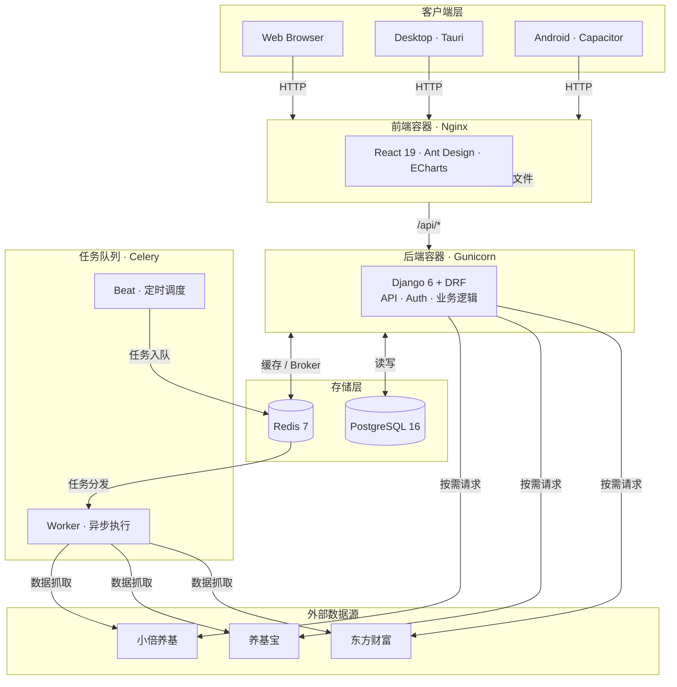

# Fundval


**盘中基金实时估值与逻辑审计系统**

拒绝黑箱，拒绝情绪化叙事。基于透明的持仓穿透 + 实时行情加权计算 + 硬核数学模型，让基金估值回归数学事实。


试用网址：https://fund.jasxu.dpdns.org/

**警告**：试用环境请勿使用真实持仓数据和 API Key

服务器内存和 CPU 性能较低，仅做使用演示

---

## 加入讨论群组

[issue - 讨论群组](https://github.com/Ye-Yu-Mo/FundVal-Live/issues/41)

## 遇到问题？

**[问题排查手册](docs/问题排查.md)** — 涵盖注册、部署、数据源、持仓计算等常见问题的完整排查指南

## 功能特性

- **实时估值**：基于持仓穿透 + 实时行情加权计算，支持东方财富、养基宝、小倍养基三数据源
- **持仓穿透**：指数/ETF 基金前十大持仓股实时行情，瀑布图 + 表格双视图，30s 自动刷新
- **基金 PK 对比**：2-5 只基金雷达图多维对比，收益/风险/回撤/夏普一站图，结果可分享
- **基金排行榜**：涨幅榜 / 人气榜 / 估值准度榜，分类板块筛选
- **大盘指数**：上证、深证、创业板、科创50 实时行情，30s 自动刷新
- **AI 分析**：接入任意 OpenAI 协议大模型，内置默认提示词模板，基金/持仓/投资报告三维度
- **AI 投资报告**：AI 生成周报/月报/年报，Markdown 格式，可推送到 Webhook/邮件
- **暗色模式**：全局浅色/深色主题切换，偏好持久化，全站 15 个文件颜色 token 化
- **养基宝集成**：扫码登录、一键导入持仓、实时估值同步
- **小倍养基集成**：手机号 + 短信验证码登录，按账户分组一键导入全部持仓
- **持仓管理**：多账户、父子账户结构，支持买入/卖出流水，自动重算持仓
- **管理员面板**：用户管理、系统统计、Celery 任务手动触发
- **多渠道通知**：基金涨跌幅阈值触发，飞书/钉钉/企业微信/邮件
- **历史净值**：净值走势图，支持多种时间范围 + 当日盘中估值曲线
- **估值准确率**：多数据源误差对比，历史准确率趋势
- **自选列表**：自定义基金分组，分组综合涨跌幅 badge，可拖拽排序
- **数据源偏好**：用户级别数据源切换，主题/报告偏好持久化


## 快速开始

整个项目分为服务端 客户端两部分

服务端可以使用 Docker 或手动部署

### 最快方式（Docker）

#### 1. 下载配置文件

```bash
# 下载 docker-compose.yml
curl -O https://raw.githubusercontent.com/Ye-Yu-Mo/FundVal-Live/main/docker-compose.yml

# 下载环境变量模板
curl -O https://raw.githubusercontent.com/Ye-Yu-Mo/FundVal-Live/main/.env.example

# 复制为 .env 并修改配置
cp .env.example .env
```

#### 2. 修改配置

**请注意**：如果你是在**服务器**，**NAS**等机器上部署（非本机访问情况下），需要修改`ALLOWED_HOSTS`项目，`ALLOWED_HOSTS=*`

编辑 `.env` 文件，自定义配置：

```bash
# 数据库配置
POSTGRES_DB=fundval
POSTGRES_USER=fundval
POSTGRES_PASSWORD=change_me_in_production  # ⚠️ 生产环境请修改
POSTGRES_PORT=5432
POSTGRES_IMAGE=postgres:16-alpine  # 数据库镜像版本

# Django 配置
SECRET_KEY=change_me_in_production_use_random_string  # ⚠️ 生产环境请修改
DEBUG=false
ALLOWED_HOSTS=localhost,127.0.0.1  # 生产环境添加你的域名

# Redis 配置
REDIS_IMAGE=redis:7-alpine  # Redis 镜像版本
REDIS_URL=redis://redis:6379/0

# 应用配置
ALLOW_REGISTER=false  # 是否允许用户注册

# 前端配置
FRONTEND_PORT=21345  # 前端访问端口
FRONTEND_IMAGE=jasamine/fundval-frontend:latest  # 前端镜像版本

# 后端配置
BACKEND_IMAGE=jasamine/fundval-backend:latest  # 后端镜像版本
GUNICORN_WORKERS=4  # Gunicorn 工作进程数（根据 CPU 核心数调整）

# Celery 配置
CELERY_LOGLEVEL=info  # 日志级别：debug, info, warning, error
```

**性能调优建议**：
- `GUNICORN_WORKERS`：推荐设置为 `(CPU 核心数 × 2) + 1`
- `CELERY_LOGLEVEL`：生产环境建议使用 `warning` 减少日志输出
- 高负载场景可使用 `POSTGRES_IMAGE=postgres:16` 替代 alpine 版本

**自定义数据库端口**（可选）：
如需从宿主机直接访问数据库（调试/备份），需同时修改两处：
1. 在 `.env` 中设置 `POSTGRES_PORT=5432`（或其他端口）
2. 在 `docker-compose.yml` 中取消注释 `db.ports` 配置行

#### 3. 启动服务

```bash
docker-compose up -d
```

#### 4. 访问应用

访问 http://localhost:21345（或你在 `.env` 中配置的端口）

**首次启动**：
- 系统会自动运行数据库迁移
- 自动同步基金数据（需要等待几分钟）
- 控制台会显示 **Bootstrap Key**，用于初始化管理员账户

**查看日志**：

```bash
docker-compose logs -f backend  # 查看后端日志和 Bootstrap Key
```

#### 5. 更新到最新版本

新版本发布后，按以下步骤更新，数据不会丢失：

```bash
# 1. 拉取所有最新镜像
docker compose pull

# 2. 如有新数据库迁移，先执行（重要）
docker compose exec backend python manage.py migrate --noinput

# 3. 重启所有服务
docker compose up -d --no-deps backend frontend celery-beat celery-worker

# 4. 等待服务启动后验证
sleep 5
curl http://localhost:21345/api/health/
```

**注意**：
- `postgres_data` 和 `config_data` 两个 volume 是持久化的，更新不会影响数据
- `.env` 文件不会被覆盖，自定义配置保留
- 如果 `.env` 有新增的配置项，需要对照 `.env.example` 手动添加
- 更新后如页面仍显示旧版，请**强制刷新浏览器**（Ctrl+Shift+R / Cmd+Shift+R）清除 JS 缓存
- 如遇 `加载基金数据失败` 等错误，通常是未执行迁移导致，执行第 2 步即可

#### 6. 常见问题

| 问题 | 原因 | 解决 |
|------|------|------|
| 页面报错 `加载基金数据失败` | 更新后未执行数据库迁移 | `docker compose exec backend python manage.py migrate --noinput` |
| 更新后页面仍是旧版 | 浏览器缓存了旧 JS 文件 | 强制刷新（Ctrl+Shift+R）或开无痕窗口 |
| Celery 任务不执行 | celery-beat 容器未更新 | `docker compose up -d --no-deps celery-beat` |

更多问题参考 [问题排查手册](docs/问题排查.md)。

### 手动部署

#### 必需组件
- **Python**: 3.13+
- **Node.js**: 20+
- **npm**: 9+
- **uv**: Python 包管理器
- **数据库**: SQLite 3.x 或 PostgreSQL 16+

#### 可选组件
- **Redis**: 用于 Celery 任务队列（可选）
- **Nginx**: 生产环境反向代理（推荐）

#### 开始部署

```bash
git clone https://github.com/Ye-Yu-Mo/FundVal-Live.git
cd FundVal-Live
```

运行构建脚本

```bash
chmod +x build.sh
./build.sh
```

依次选择 构建前端，端口号设定，数据库初始化，静态文件收集

```bash
chmod +x start.sh stop.sh
./start.sh
```

### 管理员设置（必读）

启动之后，需要在日志中获取 Bootstrap Key

- Docker 用户：`docker-compose logs backend | grep 'BOOTSTRAP KEY'`
- 手动部署用户：运行 `./start.sh` 即可看到

然后访问 `http://localhost:21345/initialize`（需要换成你自己的 IP + 端口）进行初始化

填入 BOOTSTRAP KEY，配置管理员账户和密码，是否开通注册功能

如果开启注册功能，需要**重新启动后端**

## 技术栈

- **Frontend**: React 19 + Vite + Ant Design + ECharts
- **Backend**: Django 6 + DRF + Celery
- **Database**: PostgreSQL 16
- **Cache**: Redis 7
- **Platform**: Web + Desktop (Tauri) + Android (Capacitor)

### 客户端

可以通过Web页面直接访问使用，无需客户端

其他版本客户端，需前往 [Releases](https://github.com/Ye-Yu-Mo/FundVal-Live/releases/latest) 下载最新版本：

目前支持

* 安卓客户端
* macOS (ARM64)
* macOS (x86_64)
* Windows
* Linux

## 架构



前端通过 Nginx 反向代理 `/api/` 到后端。Celery Beat 定时触发净值同步，Worker 并发抓取多数据源后写入 PostgreSQL。

### 容器启动流程

Docker 容器启动时，`backend/entrypoint.sh` 会自动执行：

1. 等待数据库就绪
2. 运行数据库迁移 (`migrate`)
3. 收集静态文件 (`collectstatic`)
4. 检查系统初始化状态 (`check_bootstrap`)
5. **自动同步基金数据**（仅在数据库为空时，`sync_funds --if-empty`）
6. 启动应用

如需手动同步基金数据：

```bash
# Docker 环境
docker-compose exec backend python manage.py sync_funds

# 手动部署
cd backend && uv run python manage.py sync_funds
```

## 项目结构

```
fundval/
├── frontend/          # React 前端
├── backend/           # Django 后端
│   ├── api/
│   │   ├── sources/   # 数据源（东方财富、养基宝、小倍养基）
│   │   └── services/  # 业务逻辑（持仓计算、养基宝/小倍养基导入）
│   └── entrypoint.sh  # Docker 启动脚本（自动迁移）
├── docker-compose.yml # Docker 编排
├── start.sh           # 手动部署启动脚本（自动迁移）
└── .github/workflows/ # CI/CD
```


---

## 开源协议

本项目采用 **GNU Affero General Public License v3.0 (AGPL-3.0)** 开源协议。

**这意味着**：
- 你可以自由使用、修改、分发本软件
- 个人使用无需开源你的修改
- 如果你用本项目代码提供网络服务（SaaS），必须开源你的修改
- 衍生作品必须使用相同协议

**为什么选择 AGPL-3.0？**
- 金融工具需要透明度，用户有权知道估值逻辑
- 防止闭源商业化，确保改进回流社区
- 保护开源生态，避免"拿来主义"

详见 [LICENSE](LICENSE) 文件。

---

## 免责声明

本项目提供的数据与分析仅供技术研究使用，不构成任何投资建议。市场有风险，代码无绝对，交易需谨慎。

---

## Star History

[](https://www.star-history.com/#Ye-Yu-Mo/FundVal-Live&type=date&legend=top-left)
